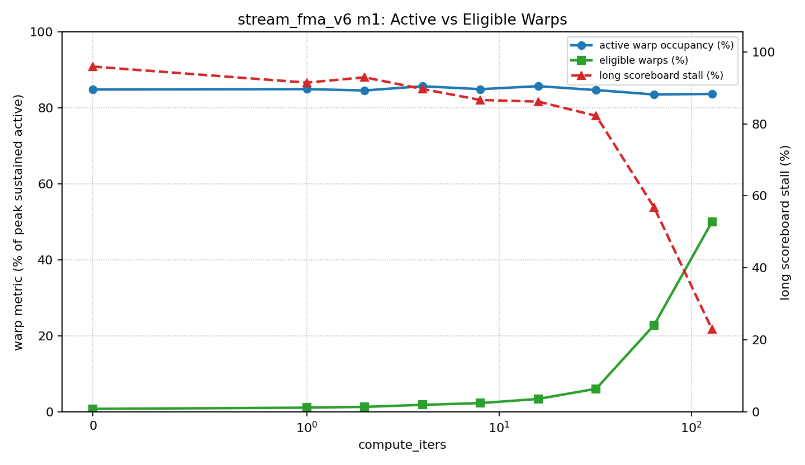

# stream_fma_v6 Compute-Iters Sweep

## Scope

This is the NCU compute sweep for `stream_fma_v6_m1_kernel`.

| compute_iters | AI algorithm | GFLOP/s | DRAM GB/s | DRAM peak % | long score % | active occ % | eligible % | eligible warps/SMSP cycle |
| ---: | ---: | ---: | ---: | ---: | ---: | ---: | ---: | ---: |
| 0 | 0.125 | 137.3 | 823.9 | 87.13 | 95.88 | 84.88 | 0.85 | 0.10 |
| 1 | 0.500 | 544.4 | 816.9 | 86.49 | 91.43 | 84.98 | 1.17 | 0.14 |
| 2 | 0.875 | 954.7 | 818.7 | 86.73 | 92.91 | 84.63 | 1.38 | 0.17 |
| 4 | 1.625 | 1769.3 | 816.9 | 86.63 | 89.66 | 85.74 | 1.91 | 0.23 |
| 8 | 3.125 | 3353.0 | 805.0 | 85.41 | 86.62 | 84.97 | 2.37 | 0.28 |
| 16 | 6.125 | 6613.2 | 810.1 | 85.70 | 86.17 | 85.76 | 3.47 | 0.42 |
| 32 | 12.125 | 13064.0 | 808.4 | 85.70 | 82.22 | 84.73 | 6.15 | 0.74 |
| 64 | 24.125 | 25255.2 | 785.4 | 82.97 | 56.84 | 83.57 | 22.90 | 2.75 |
| 128 | 48.125 | 38507.2 | 600.3 | 63.50 | 23.00 | 83.72 | 50.06 | 6.01 |

