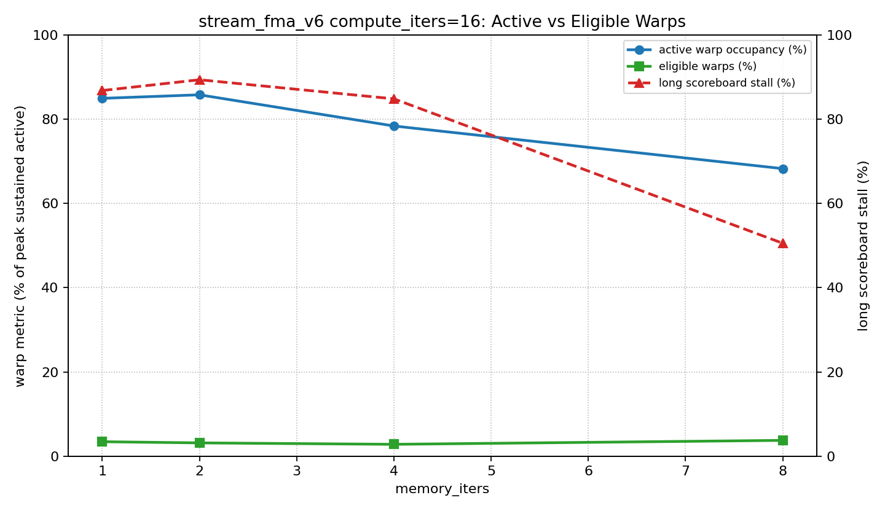

# stream_fma_v6 Memory-Iters Sweep

## Scope

This profiles `stream_fma_v6` with fixed `n=1032192` and `compute_iters=16`, sweeping
`memory_iters=1,2,4,8`. Unlike v2, v6 has no outer rounds; increasing
`memory_iters` reduces CTA count because each thread handles more elements once.

## Results and v2 Comparison

| memory_iters | v6 CTAs | v6 GFLOP/s | v2 GFLOP/s | v6 DRAM GB/s | v2 DRAM GB/s | v6 long score % | v2 long score % | v6 active occ % | v2 occ % | v6 eligible % | eligible warps/SMSP cycle |
| ---: | ---: | ---: | ---: | ---: | ---: | ---: | ---: | ---: | ---: | ---: | ---: |
| 1 | 4032 | 6669.0 | 6464.4 | 816.9 | 792.1 | 86.86 | 87.20 | 85.00 | 95.15 | 3.41 | 0.41 |
| 2 | 2016 | 6490.9 | 6284.5 | 795.2 | 770.2 | 89.42 | 91.06 | 85.84 | 70.81 | 3.13 | 0.38 |
| 4 | 1008 | 6531.2 | 6347.6 | 800.2 | 777.9 | 84.88 | 84.13 | 78.43 | 82.51 | 2.79 | 0.33 |
| 8 | 504 | 6386.0 | 6284.5 | 782.4 | 770.2 | 50.57 | 52.70 | 68.30 | 67.09 | 3.73 | 0.45 |

## Interpretation

v2 keeps CTAs fixed at 504 and changes outer rounds. v6 keeps total work fixed
and reduces CTAs from 4032 to 504 as `memory_iters` grows from 1 to 8. This
separates per-thread batching from round-based thread reuse.
