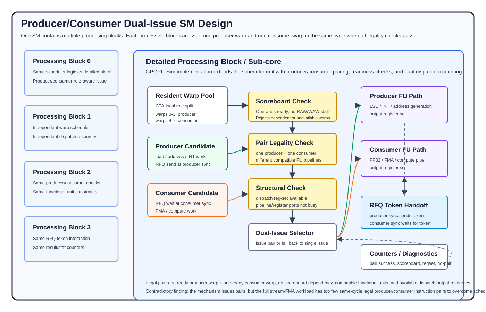

# Agent Result: Producer-Consumer Dual Issue

## 1. Supported Report Sections

- Section 6.2, **Design and Contradictory Finding: Dual Issue**
- Section 8.1.2, **Evaluation: GPGPU-Sim Dual-Issue**

## 2. Task Scope

This result compares two implementations:

- `WS_BASE`: faithful H200-style hardware with the warp-specialized stream-FMA
  kernel.
- `DUAL_ISSUE_PC`: producer-consumer dual-issue hardware with the V3
  RFQ-shaped warp-specialized stream-FMA kernel.

The goal was to test whether the scheduler can issue one producer warp
instruction and one consumer warp instruction together in the same processing
block, and whether that dual issue is enough to outperform the warp-specialized
baseline.

## 3. Design



Figure 1 shows the implemented dual-issue path. Each SM is modeled as multiple
processing blocks, and each processing block owns a warp scheduler, dispatch
resources, operand collection, and functional-unit paths. The dual-issue
extension makes the scheduler role-aware: within each CTA, the first four warps
are treated as producer warps and the next four warps are treated as consumer
warps. The V3 kernel keeps this same producer/consumer geometry as `WS_BASE`,
but replaces the two-slot shared-memory handoff with queue-shaped producer and
consumer synchronization so that the simulator can model an RFQ-style token
handoff.

On each scheduler cycle, the processing block searches for a legal
producer-consumer pair. A legal pair must contain exactly one producer warp and
one consumer warp. Both candidate instructions must pass the normal scoreboard
checks, meaning their operands are ready and the two instructions do not create
an unresolved dependency hazard. The scheduler then checks structural
constraints: the two instructions must use compatible functional-unit paths, the
dispatch register sets must be available, and the output pipeline resources
must not be busy. When all checks pass, both instructions are issued in the same
cycle. Otherwise, the scheduler falls back to the normal single-issue path.

The intended opportunity is that producer warps often execute memory, address
generation, or integer instructions, while consumer warps often execute FP32/FMA
instructions. If those instruction windows are ready at the same time, the
processing block can use otherwise separate resources in the same cycle.

## 4. Environment and Setup

The experiment used GPGPU-Sim v4.2.0 with the H200-like `base_tier1`
configuration:

```text
01_doc/01_writing/h200_config/base_tier1/
```

The benchmark source is:

```text
01_doc/01_writing/stream_fma_v6_v2_m4_c128_cta512.cu
```

Build command:

```bash
make -C 01_doc/01_writing NVCC=/usr/local/cuda-11.7/bin/nvcc ARCH=sm_70
```

Full-run workload:

```text
--n 524288 --iters 128 --memory-iters 4 --warmup 0 --repeats 1
```

The speedup denominator is `WS_BASE`:

```text
speedup = cycles(WS_BASE) / cycles(DUAL_ISSUE_PC)
```

## 5. Results

### Main Full-Scale Result

| Implementation | Kernel | Cycles | Instructions | Pair successes | Correct | Speedup vs `WS_BASE` |
|---|---|---:|---:|---:|---|---:|
| `WS_BASE` | warp-specialized V2 | 54,110 | 281,149,440 | 0 | PASS | 1.000x |
| `DUAL_ISSUE_PC` | dual-issue/RFQ V3 | 59,165 | 281,149,440 | 188,694 | PASS | 0.915x |

The dual-issue design successfully issued producer-consumer pairs, but the
full-scale run was slower than the warp-specialized baseline. In cycle terms,
`DUAL_ISSUE_PC` is 9.34% slower than `WS_BASE`.

### Pairing Diagnostics

| Metric | Count |
|---|---:|
| Pair attempts | 25,507,328 |
| Pair successes | 188,694 |
| Scoreboard failures | 17,707,793 |
| No-producer windows | 6,611,605 |
| Register-set busy failures | 89,731 |
| Pair-blocked pipe/register cycles | 21,691 |
| Both-ready cycles | 238,404 |

The successful-pair rate is low relative to total attempts. Most failed pair
opportunities are caused by scoreboard timing or by cycles where the scheduler
does not see a useful producer candidate. This means the hardware mechanism is
present, but the kernel does not provide enough simultaneous ready producer and
consumer instructions for the mechanism to dominate runtime.

### Short Scout Result

A smaller 16-CTA scout run showed that dual issue can help when the workload is
underfilled enough that successful pairs remove exposed issue bubbles.

| Implementation | `n` | Cycles | Pair successes | Correct | Speedup vs `WS_BASE` |
|---|---:|---:|---:|---|---:|
| `WS_BASE` | 16,384 | 28,201 | 0 | PASS | 1.000x |
| `DUAL_ISSUE_PC` | 16,384 | 28,101 | 2,620 | PASS | 1.004x |

This positive scout result is small, but it confirms that the scheduler
mechanism is functional. The full-scale result shows that the mechanism is not
sufficient when producer and consumer ready windows are already naturally
overlapped by the warp-specialized baseline.

## 6. Interpretation

The contradictory finding is that producer-consumer dual issue works, but it
does not improve the main stream-FMA workload. The design creates additional
same-cycle issue opportunities, and the simulator records 188,694 successful
pairs. However, this is too small compared with the number of scheduling cycles
where candidate pairs are blocked by dependencies or absent producer windows.

The result suggests that the limiting factor is not simply issue width. The
warp-specialized V2 kernel already overlaps producer and consumer work well at
512 CTAs on the H200-like configuration. The V3 RFQ-shaped kernel changes the
handoff and scheduling behavior, but it does not create enough additional
same-cycle independent work to offset the overheads and lost natural overlap.
In this workload, dual issue needs a kernel with more aligned producer memory or
integer windows and consumer FMA windows, or a hardware scheduler that can find
more legal pairs without perturbing the baseline's existing overlap.

## 7. Limitations

- This result is from one stream-FMA microbenchmark family and one H200-like
  GPGPU-Sim configuration.
- The RFQ behavior is modeled through simulator token semantics and a
  queue-shaped CUDA handoff, not a complete physical RFQ capacity/area model.
- The result does not prove producer-consumer dual issue is generally
  ineffective. It shows that this particular full-scale warp-specialized kernel
  does not expose enough legal same-cycle pairs.
- The block diagram abstracts details such as exact operand collector timing,
  register-bank conflicts, and all fallback scheduler paths.

## 8. Report-Ready Paragraph

We implemented a producer-consumer dual-issue scheduler in GPGPU-Sim to test
whether warp-specialized producer and consumer stages can use a processing
block's resources more effectively. The scheduler classifies CTA-local warps as
producer or consumer warps, searches for one ready producer and one ready
consumer instruction, checks scoreboard dependencies and structural hazards,
and issues the pair only when the functional-unit and dispatch resources are
compatible. Although the mechanism successfully issued 188,694
producer-consumer pairs, the main stream-FMA experiment did not speed up:
`WS_BASE` completed in 54,110 cycles, while `DUAL_ISSUE_PC` required 59,165
cycles, or 0.915x the baseline speed. The diagnostics show that most attempted
pairs were blocked by scoreboard timing or missing producer windows, so the
contradictory finding is that dual issue exists architecturally but the tested
kernel does not expose enough simultaneous independent producer and consumer
instructions for it to improve full-scale performance.
