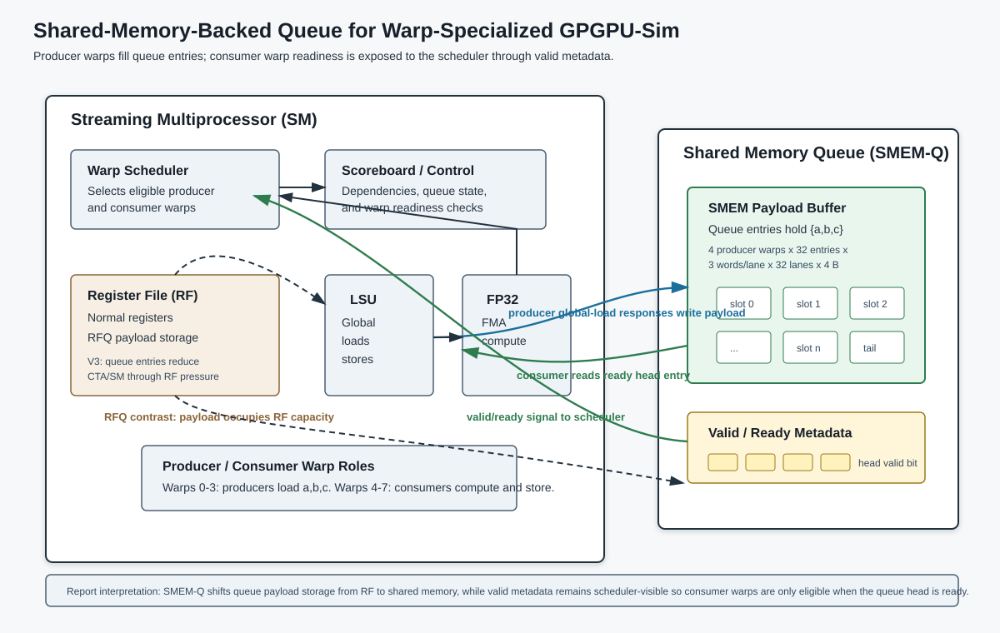

# Agent Result: GPGPU-Sim RFQ and SMEM-Q Variants

## 1. Supported Report Sections

- Section 6.1, Design and Contradictory Finding: SMEM-Based Queue
- Section 7.1, Methodology: GPGPU-Sim Configuration
- Section 7.2, Methodology: Kernels
- Section 8.1, Evaluation: GPGPU-Sim SMEM-Based Queue

## 2. Task Scope

This result documents the GPGPU-Sim implementation and evaluation of two warp-specialized producer-consumer queue variants:

- `WASP_RFQ`: Variant 3, register-file-backed queue.
- `SMEM_Q`: Variant 3a, shared-memory-backed queue with scheduler-visible valid/ready metadata.

The comparison isolates queue storage choice. Both variants use the same generated producer-consumer stream-FMA PTX shape, same launch geometry, same H200-like simulator configuration, and no producer-consumer dual issue.

## 3. Environment and Setup

The simulator is GPGPU-Sim 4.2.0 with local WASP/RFQ and SMEM-Q additions. The base configuration is the H200-like `config_h200_132sm_mshr512` setup:

| Parameter | Value |
|---|---:|
| SMs | 132 |
| Cores per cluster | 1 |
| Shader registers per SM | 65,536 |
| Shared memory per SM | 233,472 B |
| Shared memory per block cap | 232,448 B |
| HBM channels | 24 |
| DRAM bus width | 32 B/channel |
| DRAM DDR ratio | 2 |
| Clock domains | 1980/1980/1980/3125 MHz |
| Full DRAM bandwidth used for reporting | 4800 GB/s |

Run logs and per-run configs are stored under:

```text
00_doc/02_variant_data/variant_results/v3a/cta_count_sweep_m4_c128/cta512_d32_pad0_m4_c128/
```

## 4. GPGPU-Sim Queue Configuration

`WASP_RFQ` enables the register-file queue model:

```text
-gpgpu_wasp_enable 1
-gpgpu_wasp_rfq_enable 1
-gpgpu_wasp_rfq_entries 32
-gpgpu_wasp_max_pipeline_stages 16
-gpgpu_wasp_rfq_count_register_pressure 1
-gpgpu_wasp_rfq_model_data 1
-gpgpu_wasp_rfq_strict_fifo 1
-gpgpu_wasp_rfq_assert_mask_match 1
-gpgpu_wasp_metadata_file .../stream_fma_v6_variant3.metadata
```

`SMEM_Q` disables RFQ and enables the shared-memory-backed queue:

```text
-gpgpu_smemq_enable 1
-gpgpu_smemq_entries 32
-gpgpu_smemq_scheduler_ready 1
-gpgpu_smemq_model_data 1
-gpgpu_smemq_assert_mask_match 1
-gpgpu_smemq_bank_conflict_model 0
-gpgpu_smemq_metadata_file .../stream_fma_v6_variant3a.metadata
```

The important modeling difference is resource accounting. RFQ entries count against register-file capacity; SMEM-Q payloads count against shared-memory capacity. Metadata is modeled as simulator/control state and reported separately.

## 5. Kernel Methodology

Both variants use the same stream-FMA producer-consumer geometry:

| Kernel property | Value |
|---|---:|
| CTAs | 512 |
| Threads/CTA | 256 |
| Warps/CTA | 8 |
| Producer warps | 0-3 |
| Consumer warps | 4-7 |
| Elements/CTA | 1024 |
| Chunks/CTA | 8 |
| Queue payload per lane | `{a,b,c}` = 3 float words |
| Queue depth | 32 |
| `n` | 524,288 |
| `memory_iters` | 4 |
| `compute_iters` | 128 |

The host program is built normally, but GPGPU-Sim runs generated PTX through the PTX override path. The RFQ producer instruction is:

```ptx
ld.global.rfq.v3.f32 0, [addr_a], [addr_b], [addr_c];
```

The RFQ consumer instruction is:

```ptx
mov.rfq.v3.f32 {%r5, %r6, %r7}, 0;
```

The SMEM-Q variant uses the same structure with `smemq` mnemonics:

```ptx
ld.global.smemq.v3.f32 0, [addr_a], [addr_b], [addr_c];
mov.smemq.v3.f32 {%r5, %r6, %r7}, 0;
```

These instructions are generated by:

```text
01_github/259-dae-proj/stream_fma_v6/01_analysis/04_variant3_rfq/generate_rfq_ptx.py
01_github/259-dae-proj/stream_fma_v6/01_analysis/05_variant3a_smemq/generate_smemq_ptx.py
```

## 6. Evaluation Results

Speedup is computed as:

```text
speedup = cycles(WASP_RFQ) / cycles(SMEM_Q)
```

| Variant | Cycles | Speedup vs WASP_RFQ | CTA/SM | Active Occ. | Eligible Occ. | Avg Eligible Warps/Sched | DRAM BW | Queue Footprint/CTA | Queue Max Occ. | Full Stalls | Empty Stalls | Head-Not-Ready |
|---|---:|---:|---:|---:|---:|---:|---:|---:|---:|---:|---:|---:|
| `WASP_RFQ` | 80,183 | 1.0000x | 3 | 22.9210% | 11.5139% | 1.8422 | 310.704 GB/s | 12,288 RF slots | 8 | 0 | 52,980 | 10,401,834 |
| `SMEM_Q` | 63,937 | 1.2541x | 4 | 32.8700% | 18.3275% | 2.9324 | 389.664 GB/s | 49,152 B SMEM | 8 | 0 | 72,448 | 17,109,452 |

Both runs passed numerical verification.

The performance difference is primarily an occupancy and scheduler-readiness effect. At depth 32, the RFQ model adds 12,288 register slots per CTA on top of 8,192 normal registers per CTA, for 20,480 total register slots per CTA. That reduces residency from 8 CTAs/SM before RFQ accounting to 3 CTAs/SM after RFQ accounting. The SMEM-Q stores the same payload in shared memory: 4 producer warps * 1 queue/original warp * 32 entries * 3 words/lane * 32 lanes * 4 B = 49,152 B/CTA. With 233,472 B shared memory per SM, this permits 4 CTAs/SM. The extra CTA/SM increases active occupancy from 22.9210% to 32.8700% and eligible occupancy from 11.5139% to 18.3275%, which improves DRAM bandwidth utilization from 310.704 GB/s to 389.664 GB/s and reduces total cycles by 20.3%.

This result does not prove that SMEM-Q is always faster than RFQ. It shows that, for this queue depth and workload shape, moving queue payload storage from RF capacity to shared memory recovers one CTA/SM and exposes more eligible producer/consumer work to the scheduler. The queue high-water mark is 8 entries in both runs, so the measured benefit is not from using all 32 entries; it is from the different resource accounting and resulting residency.

## 7. RFQ Implementation Details

The RFQ implementation is simulator-side and follows the WASP idea that queue payloads occupy register-file capacity rather than shared memory. The main simulator files are:

```text
gpgpu-sim_distribution/src/gpgpu-sim/wasp-rfq.h
gpgpu-sim_distribution/src/gpgpu-sim/wasp-rfq.cc
gpgpu-sim_distribution/src/gpgpu-sim/shader.h
gpgpu-sim_distribution/src/gpgpu-sim/shader.cc
```

The simulator defines one queue per original producer-consumer warp pair. A producer `ld.global.rfq.v3.f32` instruction checks whether the queue is full, reserves the tail entry, issues three global memory requests, and attaches an RFQ token to the memory operations. When memory responses return, the simulator fills the reserved RFQ entry. The entry becomes ready only after the full `{a,b,c}` payload for the active lanes has arrived. A consumer `mov.rfq.v3.f32` instruction is scheduler-eligible only when the FIFO head is ready; when it issues, it reads the head payload into consumer registers and advances the head.

The RFQ model reports reservations, memory fills, consumes, full stalls, empty stalls, head-not-ready stalls, register slots per CTA, metadata bits per CTA, adjusted CTA residency, and max queue occupancy. RFQ register pressure is computed as:

```text
producer_warps_per_cta * queues_per_original_warp * depth *
payload_words_per_lane * warp_size
```

For this run:

```text
4 * 1 * 32 * 3 * 32 = 12,288 register slots/CTA
```

This accounting is the mechanism that reduces the RFQ run to 3 CTAs/SM.

## 8. SMEM-Q Implementation Details

The SMEM-Q implementation uses the same queue semantics as RFQ but places payload storage in shared-memory capacity. The main simulator files are:

```text
gpgpu-sim_distribution/src/gpgpu-sim/wasp-smem-queue.h
gpgpu-sim_distribution/src/gpgpu-sim/wasp-smem-queue.cc
gpgpu-sim_distribution/src/gpgpu-sim/shader.h
gpgpu-sim_distribution/src/gpgpu-sim/shader.cc
```

Each queue entry has simulator metadata: head, tail, state (`FREE`, `RESERVED`, `READY`), sequence number, active mask, pending response count, and optional per-lane payload words for functional correctness. The data payload is charged to shared memory, while the valid/ready bits are modeled as control metadata.

The producer `ld.global.smemq.v3.f32` instruction reserves a tail entry if the queue is not full and attaches an SMEM-Q token to the three global memory requests. Each memory response writes the corresponding payload word into the reserved SMEM-Q slot. When all pending payload responses for the active lanes have arrived, the entry transitions to `READY`. With `-gpgpu_smemq_scheduler_ready 1`, a consumer `mov.smemq.v3.f32` instruction is not scheduler-eligible until the head entry is ready. This models a hardware-visible valid queue rather than a software polling loop.

The SMEM-Q payload footprint is computed as:

```text
producer_warps_per_cta * queues_per_original_warp * depth *
payload_words_per_lane * warp_size * sizeof(float)
```

For this run:

```text
4 * 1 * 32 * 3 * 32 * 4 = 49,152 B/CTA
```

That shared-memory footprint reduces residency from the unconstrained 8 CTAs/SM to 4 CTAs/SM. Compared with RFQ's 3 CTAs/SM, SMEM-Q leaves one additional CTA resident while preserving scheduler-visible consumer readiness.

## 9. Figure



This diagram emphasizes the design difference used in the evaluation. RFQ stores queue payloads in register-file capacity, while SMEM-Q stores queue payloads in shared memory and sends valid/ready metadata to the warp scheduler so consumer warps become eligible only when the queue head is ready.

## 10. Limitations

- This result is a GPGPU-Sim timing-model result, not a real H200 hardware run.
- SMEM-Q bank-conflict modeling was disabled for this comparison (`-gpgpu_smemq_bank_conflict_model 0`).
- The stream-FMA queue payload is fixed to `{a,b,c}` tuple entries; vectorized or scalar queue alternatives were not evaluated here.
- The run does not include producer-consumer dual issue or same-cycle cross-warp co-issue.
- The queue high-water mark is 8 entries, so depth 32 mostly affects modeled resource footprint rather than actual queue occupancy for this workload.

## 11. Report-Ready Paragraph

In GPGPU-Sim, we implemented a WASP-style register-file queue and a shared-memory-backed queue for the same generated producer-consumer stream-FMA workload. Both variants used 512 CTAs, 256 threads/CTA, 4 producer warps, 4 consumer warps, `{a,b,c}` queue entries, depth 32, `memory_iters=4`, and `compute_iters=128`. The RFQ configuration counted queue payloads against register-file capacity, adding 12,288 register slots per CTA and reducing residency to 3 CTAs/SM. The SMEM-Q configuration counted the queue payload against shared memory, using 49,152 B/CTA and allowing 4 CTAs/SM. As a result, SMEM-Q increased active occupancy from 22.9210% to 32.8700%, eligible occupancy from 11.5139% to 18.3275%, and effective DRAM bandwidth from 310.704 GB/s to 389.664 GB/s. The SMEM-Q run completed in 63,937 cycles versus 80,183 cycles for RFQ, a 1.2541x speedup relative to RFQ. This suggests that shared-memory-backed queues can be useful when RFQ register pressure is the dominant occupancy limiter, but the conclusion is specific to this simulator configuration and workload.
